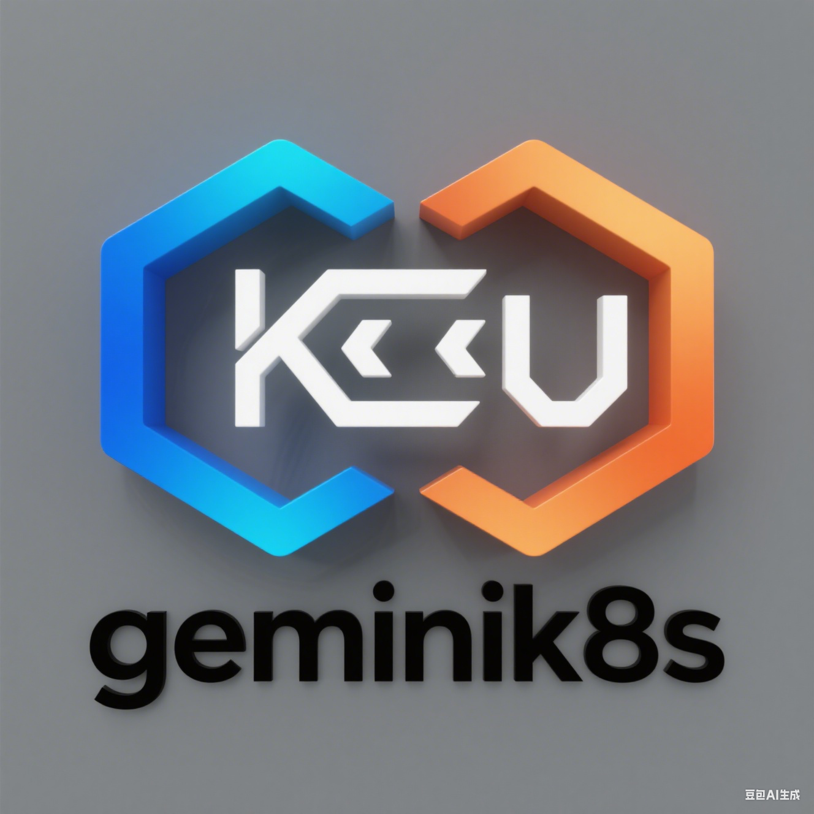

# geminik8s



[](https://github.com/turtacn/geminik8s/actions)
[](https://opensource.org/licenses/Apache-2.0)
[](https://golang.org/)
[](https://github.com/turtacn/geminik8s/releases)

> **面向成本优化部署的双节点高可用 Kubernetes 解决方案**

[English README](./README.md) | [架构文档](./docs/architecture.md)

## 🚀 项目使命

geminik8s 通过提供成本效益极高的双节点高可用解决方案，革新了 Kubernetes 部署模式。相比传统三节点集群，基础设施成本降低高达 33%，同时保持企业级可靠性和性能。

## 🎯 为什么选择 geminik8s？

**传统 Kubernetes 高可用的痛点：**
- 🔸 **高成本门槛**: 传统高可用因 etcd 法定人数要求最少需要 3 个节点
- 🔸 **资源浪费**: 为基本高可用需求进行过度配置  
- 🔸 **复杂性开销**: 管理 etcd 集群增加运维负担
- 🔸 **供应商锁定**: 存储后端选择受限

**geminik8s 的优势：**
- ✅ **成本优化**: 硬件、电力和运维成本降低 33%
- ✅ **架构简化**: PostgreSQL + Kine 替代复杂的 etcd 管理
- ✅ **生产就绪**: 经过实战检验的成本敏感部署解决方案
- ✅ **Kubernetes 原生**: 与标准 K8s/K3s 发行版完全兼容
- ✅ **自动故障转移**: 智能主节点选举和无缝节点提升
- ✅ **零停机升级**: A/B 分区策略支持自动回滚

## ✨ 核心特性

### 🏗️ 架构与基础设施
- **双节点高可用**: 传统 3 节点集群的成本效益替代方案
- **PostgreSQL 后端**: 利用强大的 SQL 数据库替代 etcd
- **Kine 集成**: 无缝的 etcd 到 SQL 转换层
- **A/B 分区**: 不可变 OS 镜像支持自动回滚

### 🔄 生命周期管理
- **智能编排**: 自动化主节点选举和故障转移
- **健康监控**: 全面的存活检查和恢复机制
- **升级自动化**: 支持回滚的零停机集群升级
- **节点替换**: 故障节点的无缝替换

### 🛠️ 开发者体验
- **CLI 优先设计**: 基于 Cobra 的直观命令行界面
- **插件架构**: 可扩展的自定义功能系统
- **配置即代码**: 声明式集群配置管理
- **多平台支持**: 跨平台二进制分发

### 🔒 企业功能
- **生产级别**: 专为企业可靠性要求设计
- **可观测性**: 内置监控和日志记录能力
- **安全性**: 标准 Kubernetes RBAC 和安全策略
- **备份恢复**: 数据保护的自动化备份策略

## 🚀 快速开始

### 安装

使用 Go 安装 geminik8s：

```bash
go install github.com/turtacn/geminik8s/cmd/gemin_k8s@latest
````

或从 [发布页面](https://github.com/turtacn/geminik8s/releases) 下载预构建二进制文件。

### 快速入门

#### 1. 初始化双节点集群配置

```bash
# 创建集群配置
gemin_k8s init --name "my-cluster" \
  --node1-ip "10.10.10.1" \
  --node2-ip "10.10.10.2" \
  --vip "10.10.10.0" \
  --config-dir "./cluster-config"
```

#### 2. 部署集群

```bash
# 部署到两个节点
gemin_k8s deploy --config-dir "./cluster-config" \
  --bootstrap-leader "node1"
```

#### 3. 验证集群状态

```bash
# 检查集群健康状况
gemin_k8s status --cluster "my-cluster"

# 示例输出:
# 集群: my-cluster
# 状态: 健康
# 主节点: node1 (10.10.10.1)
# 从节点: node2 (10.10.10.2)  
# VIP: 10.10.10.0 (在 node1 上活跃)
# 数据库: PostgreSQL + Kine (复制: 活跃)
```

#### 4. 高级操作

```bash
# 触发手动故障转移
gemin_k8s failover --cluster "my-cluster" --promote "node2"

# 升级集群
gemin_k8s upgrade --cluster "my-cluster" \
  --image "my-registry/k8s-image:v1.28.0"

# 替换故障节点
gemin_k8s replace-node --cluster "my-cluster" \
  --old-node "node2" --new-node-ip "10.10.10.3"
```

## 📖 文档

* [架构概览](./docs/architecture.md) - 详细的系统架构和设计决策
* [安装指南](./docs/installation.md) - 全面的安装说明
* [配置参考](./docs/configuration.md) - 完整的配置选项
* [操作手册](./docs/operations.md) - 第二天运维指南
* [故障排除](./docs/troubleshooting.md) - 常见问题和解决方案

## 🤝 贡献

我们欢迎社区贡献！geminik8s 由理解 Kubernetes 运维实际挑战的工程师们用 ❤️ 构建。

### 贡献方式

* 🐛 **报告问题**: 发现 bug？[创建 issue](https://github.com/turtacn/geminik8s/issues)
* 💡 **功能请求**: 有想法？我们很想听听！
* 🔧 **代码贡献**: 为 bug 修复或新功能提交 pull request
* 📝 **文档**: 帮助改进我们的文档和示例
* 🧪 **测试**: 帮助我们在不同环境中测试

### 开发环境设置

```bash
# 克隆代码仓库
git clone https://github.com/turtacn/geminik8s.git
cd geminik8s

# 安装依赖
go mod tidy

# 运行测试
make test

# 构建二进制文件
make build
```

详细贡献指南请参见 [CONTRIBUTING.md](./CONTRIBUTING.md)。

## 📜 许可证

geminik8s 采用 [Apache License 2.0](LICENSE) 许可。这意味着您可以：

* ✅ 商业使用
* ✅ 修改和分发
* ✅ 私人使用
* ✅ 专利使用

## 🌟 社区与支持

* 💬 **讨论**: [GitHub 讨论区](https://github.com/turtacn/geminik8s/discussions)
* 🐛 **问题**: [Bug 报告与功能请求](https://github.com/turtacn/geminik8s/issues)
* 📧 **联系**: [maintainers@geminik8s.io](mailto:maintainers@geminik8s.io)
* 🔗 **网站**: [https://geminik8s.io](https://geminik8s.io)

---

**为 Kubernetes 社区用 ❤️ 构建**

*降低成本不应该意味着在可靠性上妥协。geminik8s 证明了智能架构可以兼顾两者。*