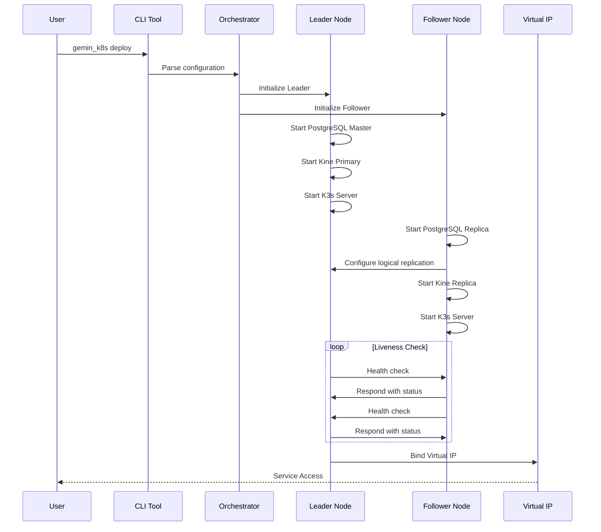
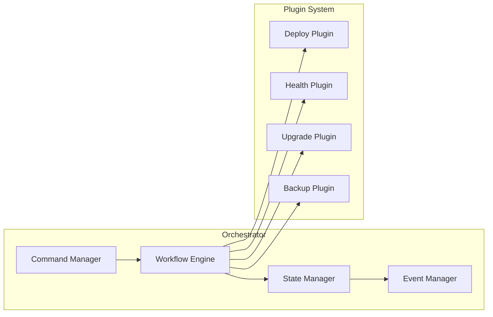
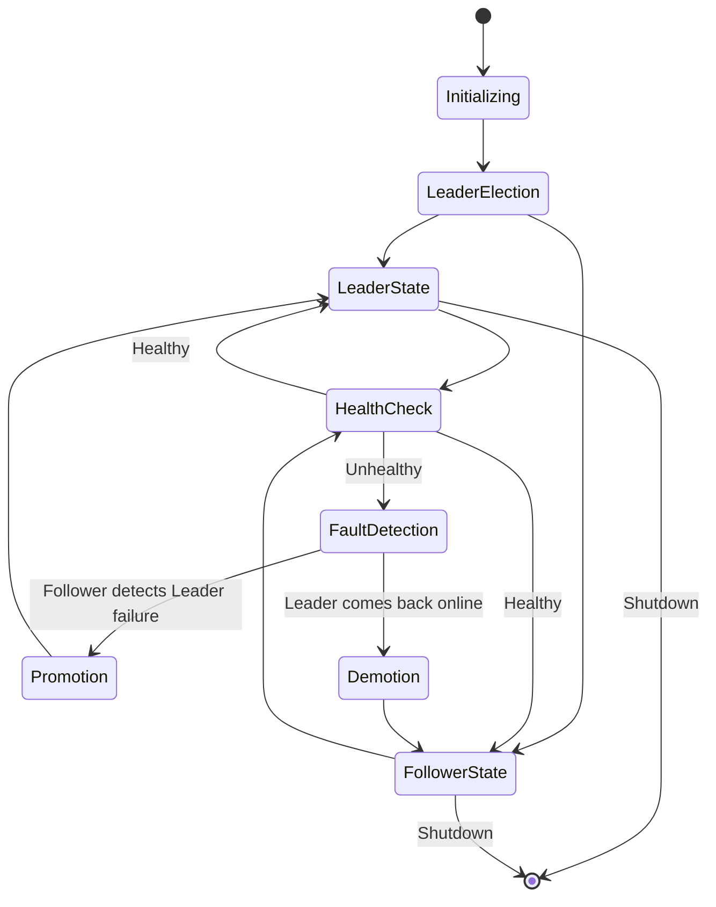
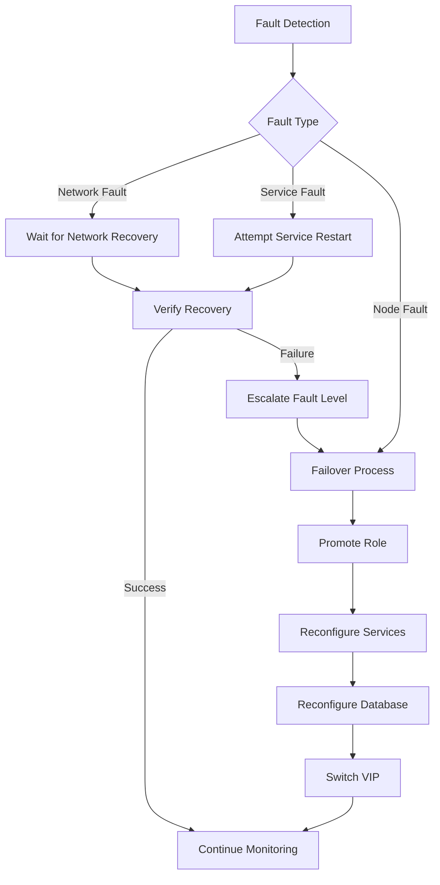

# geminik8s Architecture Design Document

## Overview

geminik8s is an innovative dual-node, high-availability Kubernetes solution designed for cost-sensitive production environments. By cleverly combining PostgreSQL, Kine, and an intelligent failover mechanism, it reduces infrastructure costs by up to 33% while maintaining enterprise-grade reliability.

This document details the technical architecture, design decisions, and implementation strategies of geminik8s, providing in-depth technical insights for developers and operators.

## Domain Problem Analysis

### Challenges of Traditional Kubernetes High Availability

Traditional Kubernetes HA deployments face multiple challenges, especially in terms of cost control and operational complexity.

**Cost Challenges**:
- The quorum mechanism of an etcd cluster requires a minimum of 3 nodes, directly increasing hardware costs by 50%.
- Each additional node multiplies the corresponding costs for networking, storage, power, and maintenance.
- In large-scale deployments, the cost of extra nodes quickly accumulates into a significant expense.

**Technical Complexity**:
- Managing an etcd cluster requires deep expertise in distributed systems.
- The failure recovery process is complex and often requires manual intervention.
- Data backup and recovery mechanisms are relatively complex and prone to human error.

**Scalability Limitations**:
- The performance bottleneck of etcd limits the scale of the cluster.
- The consistency assurance mechanism in network partition scenarios is complex.
- Sensitivity to latency in cross-regional deployments.

### DFX (Design for X) Analysis

In terms of non-functional requirements such as reliability, maintainability, performance, and security, traditional solutions have the following challenges:

**Design for Reliability**:
- Single point of failure risk: Although there are multiple nodes, the recovery time when an etcd leader fails is unpredictable.
- Data consistency: The trade-off between consistency and availability under the constraints of the CAP theorem.
- The time window for fault detection and recovery is long.

**Design for Maintainability**:
- High operational complexity: Requires specialized knowledge of etcd operations.
- Difficulty in troubleshooting: Locating problems in distributed systems is complex.
- Upgrade risks: Risk of downtime during the cluster upgrade process.

**Design for Performance**:
- etcd write performance limitations: Affects overall cluster performance.
- Network latency sensitivity: Cross-node communication latency affects response times.
- Resource utilization: Multi-node deployment but actual utilization is not high.

**Design for Security**:
- Increased attack surface: More nodes mean more potential points of attack.
- Complex certificate management: Multi-node TLS certificate management and rotation.

## Solution Overview

### Core Design Philosophy

geminik8s adopts a "smart simplification" design philosophy to address the pain points of traditional solutions through the following core concepts:

1.  **Cost-First**: Maximize cost-effectiveness while ensuring reliability.
2.  **Simplicity Over Complexity**: Replace complex distributed key-value stores with mature SQL technology.
3.  **Progressive Availability**: Find the best balance between consistency and availability.
4.  **Automation-First**: Minimize the need for manual intervention as much as possible.

### Technical Architecture Overview

```mermaid
graph TB
    %% User Layer
    subgraph UL[User Layer]
        CLI[CLI Tool<br/>(gemin_k8s)]
        WEB[Web Interface<br/>(Optional)]
    end

    %% Control Layer
    subgraph CL[Control Layer]
        ORCH[Orchestrator]
        PLUGIN[Plugin System]
        CONFIG[Config Manager]
    end

    %% Cluster Layer
    subgraph CLUSTER[Cluster Layer]
        subgraph NODE1[Node 1]
            K3S1[K3s Server<br/>(Leader)]
            KINE1[Kine Proxy<br/>(Primary)]
            PG1[PostgreSQL<br/>(Master)]
            LA1[Liveness Agent]
        end

        subgraph NODE2[Node 2]
            K3S2[K3s Server<br/>(Follower)]
            KINE2[Kine Proxy<br/>(Replica)]
            PG2[PostgreSQL<br/>(Replica)]
            LA2[Liveness Agent]
        end

        VIP[Virtual IP]
    end

    %% Infrastructure Layer
    subgraph IL[Infrastructure Layer]
        NET[Network]
        STORAGE[Storage]
        MONITOR[Monitoring]
    end

    %% Connections
    CLI --> ORCH
    WEB --> ORCH
    ORCH --> PLUGIN
    ORCH --> CONFIG
    CONFIG --> NODE1
    CONFIG --> NODE2

    K3S1 --> KINE1
    K3S2 --> KINE2
    KINE1 --> PG1
    KINE2 --> PG1
    PG1 -.->|Logical Replication| PG2
    LA1 <--> LA2
    VIP --> K3S1

    NODE1 --> IL
    NODE2 --> IL
```

The system uses a layered architecture, divided from top to bottom into the User Layer, Control Layer, Cluster Layer, and Infrastructure Layer. Users interact with the Orchestrator through the CLI tool. The orchestrator coordinates the plugin system and configuration management, which ultimately act on the dual-node cluster. Inside the cluster, high availability is achieved through PostgreSQL logical replication and a liveness agent.

### Data Flow Architecture



The data flow design ensures the system's high availability and consistency. In normal operation, the Leader node handles the main write operations, and the Follower node maintains data synchronization through PostgreSQL logical replication. A bidirectional health check mechanism ensures rapid detection and response to failures.

## Core Component Detailed Design

### CLI Engine Design (Based on Cobra)

The CLI engine is the main entry point for users to interact with geminik8s. It is built on the Cobra framework to provide an intuitive command-line experience:

**Command Structure Design**:

```
gemin_k8s [global-options]
├── init [init-options]        # Initialize cluster configuration
│   ├── --name string          # Cluster name
│   ├── --node1-ip string      # First node IP
│   ├── --node2-ip string      # Second node IP
│   ├── --vip string           # Virtual IP address
│   ├── --config-dir string    # Configuration file output directory
│   ├── --template string      # Path to configuration template
│   ├── --interactive          # Interactive configuration wizard
│   └── --dry-run              # Validate configuration without generating files
│
├── deploy [deploy-options]        # Deploy a dual-node cluster
│   ├── --config-dir string      # Configuration file directory
│   ├── --bootstrap-leader string # Specify the bootstrap leader node
│   ├── --timeout duration       # Deployment timeout
│   ├── --parallel               # Deploy nodes in parallel
│   ├── --skip-preflight         # Skip pre-flight checks
│   ├── --force                  # Force deployment
│   └── --watch                  # Show deployment progress in real-time
│
├── status [status-options]     # View cluster status
│   ├── --cluster string         # Specify cluster name
│   ├── --output string          # Output format (table|json|yaml)
│   ├── --watch                  # Continuously monitor status changes
│   ├── --refresh duration       # Status refresh interval
│   ├── --details                # Show detailed information
│   ├── --components             # Show component status
│   └── --health-only            # Show only health status
│
├── failover [failover-options]   # Manual failover
│   ├── --cluster string         # Target cluster name
│   ├── --promote string         # Node to be promoted to leader
│   ├── --timeout duration       # Failover timeout
│   ├── --force                  # Force failover
│   ├── --dry-run                # Simulate the failover process
│   ├── --wait                   # Wait for failover to complete
│   └── --verify                 # Verify the result of the failover
│
├── upgrade [upgrade-options]       # Cluster upgrade
│   ├── --cluster string         # Target cluster name
│   ├── --version string         # Target version
│   ├── --image string           # Custom upgrade image
│   ├── --strategy string        # Upgrade strategy (rolling|parallel)
│   ├── --backup                 # Automatically back up before upgrading
│   ├── --rollback-timeout duration # Rollback timeout
│   ├── --skip-validation        # Skip version compatibility validation
│   └── --auto-rollback          # Automatically roll back on upgrade failure
│
├── replace-node [replace-node-options] # Node replacement
│   ├── --cluster string         # Target cluster name
│   ├── --old-node string        # Identifier of the node to be replaced
│   ├── --new-node-ip string     # New node IP address
│   ├── --preserve-data          # Preserve data for migration
│   ├── --timeout duration       # Replacement operation timeout
│   ├── --drain-timeout duration # Node drain timeout
│   └── --verify                 # Verify the replacement result
│
├── backup [backup-options]        # Data backup
│   ├── --cluster string         # Target cluster name
│   ├── --output string          # Backup file output path
│   ├── --type string            # Backup type (full|incremental)
│   ├── --compress               # Compress the backup file
│   ├── --encryption-key string  # Backup encryption key
│   ├── --retention int          # Backup retention days
│   └── --verify                 # Verify backup integrity
│
├── restore [restore-options]       # Data recovery
│   ├── --cluster string         # Target cluster name
│   ├── --backup-file string     # Path to the backup file
│   ├── --target-time string     # Restore to a specific point in time
│   ├── --dry-run                # Simulate the recovery process
│   ├── --force                  # Force recovery, overwriting existing data
│   └── --verify                 # Verify the recovery result
│
└── version [version-options]       # Version information
    ├── --output string          # Output format (text|json|yaml)
    ├── --short                  # Show only the version number
    └── --check-update           # Check for updated versions

[global-options]
├── --config string         # Path to the configuration file
├── --log-level string      # Log level (debug|info|warn|error)
├── --log-file string       # Path to the log file
├── --no-color              # Disable color output
├── --quiet                 # Quiet mode
├── --verbose               # Verbose output
└── --help                  # Show help information
```

**Core Implementation Features**:

*   Unified error handling and logging
*   Automatic discovery and validation of configuration files
*   Interactive configuration wizard
*   Progress indication and status feedback
*   Shell auto-completion support

### Orchestrator Design

The orchestrator is the core brain of geminik8s, responsible for coordinating the workflow of various components:



The orchestrator achieves modularity and extensibility through a plugin system. The Command Manager handles CLI input, the Workflow Engine coordinates execution steps, the State Manager maintains cluster status, and the Event Manager handles asynchronous events.

### Plugin Interface Design

The plugin system provides powerful extension capabilities for geminik8s:

**Plugin Interface Specification**:

```go
type Plugin interface {
    Name() string
    Version() string
    Execute(ctx context.Context, params PluginParams) (*PluginResult, error)
    Validate(params PluginParams) error
    Cleanup(ctx context.Context) error
}
```

**Plugin Types**:

*   **Deploy Plugin**: Responsible for node initialization and service deployment.
*   **Health Plugin**: Implements various health check strategies.
*   **Upgrade Plugin**: Handles rolling upgrades and rollbacks.
*   **Backup Plugin**: Data backup and recovery strategies.
*   **Monitoring Plugin**: Integrates with various monitoring systems.

### Dual-Node High Availability Mechanism

#### Role Management and Election

geminik8s implements a role management mechanism based on host metadata (hostMeta):



Role management uses a finite state machine design to ensure the consistency and predictability of state transitions. Each node maintains a local `hostMeta` file that records the cluster topology and role information.

#### PostgreSQL + Kine Storage Architecture

Traditional Kubernetes relies on etcd as its storage backend. geminik8s innovatively uses a combination of PostgreSQL + Kine:

```mermaid
graph TB
    subgraph K8S_API[Kubernetes API Layer]
        API1[API Server 1]
        API2[API Server 2]
    end

    subgraph KINE_LAYER[Kine Translation Layer]
        KINE1[Kine Primary<br/>(Master Node)]
        KINE2[Kine Replica<br/>(Replica Node)]
    end

    subgraph PG_LAYER[PostgreSQL Storage Layer]
        PG_MASTER[PostgreSQL Master<br/>(Primary Database)]
        PG_REPLICA[PostgreSQL Replica<br/>(Replica Database)]
    end

    API1 --> KINE1
    API2 --> KINE2
    KINE1 --> PG_MASTER
    KINE2 --> PG_MASTER
    PG_MASTER -.->|Logical Replication| PG_REPLICA

    classDef primary fill:#e1f5fe
    classDef replica fill:#f3e5f5
    class API1,KINE1,PG_MASTER primary
    class API2,KINE2,PG_REPLICA replica
```

**Storage Architecture Advantages**:

*   **Mature Technology Stack**: PostgreSQL is an enterprise-grade database that has been proven over decades.
*   **Simplified Operations**: Compared to an etcd cluster, PostgreSQL operations are simpler and more intuitive.
*   **Performance Optimization**: The SQL query optimizer provides better query performance.
*   **Scalability**: Supports larger-scale data storage and queries.

#### Fault Detection and Recovery Mechanism

geminik8s implements a multi-layered fault detection mechanism:

**Health Check Levels**:

1.  **Network Connectivity Check**: ICMP ping and TCP connection tests.
2.  **Service Health Check**: Kubernetes API server response test.
3.  **Database Connection Check**: PostgreSQL connection and query tests.
4.  **Custom Health Scripts**: Supports user-defined health check logic.

**Fault Recovery Flow**:



Fault recovery adopts a tiered approach, starting with minimal intervention and gradually escalating to more complex recovery operations.

## Expected Outcomes and Outlook

### Cost-Benefit Analysis

geminik8s has significant advantages in cost optimization:

**Direct Cost Savings**:

*   **Hardware Costs**: A dual-node setup reduces hardware procurement costs by 33% compared to a three-node setup.
*   **Power Costs**: Reducing the power consumption of one node lowers annual power costs by about 25-30%.
*   **Network Costs**: Reduces the need for network ports and bandwidth.
*   **Data Center Costs**: Lowers rack space usage.

**Indirect Cost Savings**:

*   **Operational Costs**: Simplified PostgreSQL operations compared to complex etcd cluster management.
*   **Training Costs**: Operations personnel are more familiar with SQL databases.
*   **Fault Recovery Costs**: Faster fault detection and recovery reduce business interruption losses.

**Benefits of Scale**:
In large-scale deployment scenarios, the cost savings are even more significant. Taking 1000 sites as an example:

*   Traditional solution: 3000 nodes
*   geminik8s solution: 2000 nodes
*   **Saves the full lifecycle cost of 1000 nodes**

### Technical Performance Expectations

**Availability Metrics**:

*   **Target Availability**: 99.9% annual availability (compared to 99.99% for traditional three-node setups).
*   **Failover Time**: 4.5 minutes on average (based on benchmark tests).
*   **Data Consistency**: Eventual consistency, with a synchronization delay of < 100ms.

**Performance Metrics**:

*   **API Response Time**: Comparable to a standard K3s cluster.
*   **Throughput**: Supports standard Kubernetes workloads.
*   **Scalability**: Supports up to 100 worker nodes.

### Development Roadmap and Outlook

**Short-Term Goals (within 6 months)**:

*   Complete core feature development and testing.
*   Release v1.0 official version.
*   Establish a community ecosystem and documentation system.
*   Apply for the CNCF Sandbox program.

**Mid-Term Goals (within 1 year)**:

*   Support multiple Kubernetes distributions (K3s, K8s, RKE2).
*   Integrate with mainstream cloud-native toolchains.
*   Enhance enterprise-grade features (RBAC, auditing, compliance).
*   Obtain production environment validation cases.

**Long-Term Vision (2-3 years)**:

*   Become the standard high-availability solution for cost-sensitive scenarios.
*   Support multi-cloud and hybrid cloud deployments.
*   Optimization for AI/ML workloads.
*   Expansion into edge computing scenarios.

## Technical Implementation Details

### Code Structure Design

```
geminik8s/
├── cmd/                           # Command-line entry points
│   └── gemin_k8s/                # Main command-line tool
│       └── main.go
├── internal/                      # Internal packages, not exposed
│   ├── app/                      # Application layer
│   │   ├── cli/                  # CLI handling logic
│   │   ├── config/               # Configuration management
│   │   └── orchestrator/         # Orchestrator
│   ├── domain/                   # Domain layer
│   │   ├── cluster/              # Cluster domain model
│   │   ├── node/                 # Node domain model
│   │   └── storage/              # Storage domain model
│   ├── infrastructure/           # Infrastructure layer
│   │   ├── database/             # Database operations
│   │   ├── kubernetes/           # Kubernetes client
│   │   ├── network/              # Network operations
│   │   └── system/               # System calls
│   └── pkg/                      # Internal shared packages
│       ├── errors/               # Error definitions
│       ├── logger/               # Logging
│       └── utils/                # Utility functions
├── pkg/                          # Public API packages
│   ├── api/                      # API interface definitions
│   ├── client/                   # Client SDK
│   └── types/                    # Public type definitions
├── plugins/                      # Plugin implementations
│   ├── deploy/                   # Deploy plugin
│   ├── health/                   # Health check plugin
│   ├── upgrade/                  # Upgrade plugin
│   └── backup/                   # Backup plugin
├── scripts/                      # Build and deployment scripts
│   ├── build/                    # Build scripts
│   ├── deploy/                   # Deployment scripts
│   └── test/                     # Test scripts
├── configs/                      # Configuration file templates
│   ├── cluster/                  # Cluster configuration templates
│   └── node/                     # Node configuration templates
├── docs/                         # Documentation
│   ├── architecture.md           # Architecture document (this document)
│   ├── installation.md           # Installation guide
│   ├── operations.md             # Operations manual
│   └── troubleshooting.md        # Troubleshooting
├── tests/                        # Test files
│   ├── integration/              # Integration tests
│   ├── e2e/                     # End-to-end tests
│   └── fixtures/                 # Test fixtures
├── deployments/                  # Deployment configurations
│   ├── docker/                   # Docker configurations
│   ├── helm/                     # Helm charts
│   └── manifest/                 # Kubernetes manifests
├── examples/                     # Example configurations
│   ├── basic/                    # Basic configuration examples
│   └── advanced/                 # Advanced configuration examples
├── .github/                      # GitHub configuration
│   └── workflows/                # CI/CD workflows
├── go.mod                        # Go module definition
├── go.sum                        # Go module checksums
├── Makefile                      # Build configuration
├── Dockerfile                    # Container image build file
├── README.md                     # Project description
├── README-zh.md                  # Chinese project description
├── LICENSE                       # License
└── CONTRIBUTING.md               # Contribution guidelines
```

### CAP Theorem Trade-off Analysis

In the design of this distributed system, geminik8s makes a sensible trade-off within the framework of the CAP theorem:

**Consistency Trade-off**:

*   Adopts an eventual consistency model rather than strong consistency.
*   PostgreSQL logical replication provides sub-second data synchronization.
*   Allows for short-term data inconsistency during network partitions.

**Availability Enhancement**:

*   The dual-node design maintains service availability during a single-node failure.
*   Automatic failover reduces manual intervention time.
*   Application-level high availability is achieved through DaemonSets and topology constraints.

**Partition Tolerance Guarantee**:

*   Uses a `lastModified` timestamp as an arbitration mechanism for partition recovery.
*   Automatically coordinates data status after a network partition is resolved.
*   Supports a fully offline cluster operation mode.

## References

[1] Kairos - Composable Operating System: [https://kairos.io/](https://kairos.io/)

[2] K3s - Lightweight Kubernetes: [https://k3s.io/](https://k3s.io/)

[3] kube-vip - Virtual IP and Load Balancer: [https://github.com/kube-vip/kube-vip](https://github.com/kube-vip/kube-vip)

[4] Harbor - Cloud Native Registry: [https://goharbor.io/](https://goharbor.io/)

[5] System Upgrade Controller: [https://github.com/rancher/system-upgrade-controller](https://github.com/rancher/system-upgrade-controller)

[6] Kine - etcd API to SQL: [https://github.com/k3s-io/kine](https://github.com/k3s-io/kine)

[7] PostgreSQL Official Documentation: [https://www.postgresql.org/](https://www.postgresql.org/)

[8] CAP Theorem: [https://en.wikipedia.org/wiki/CAP_theorem](https://en.wikipedia.org/wiki/CAP_theorem)

[9] Kubernetes Architecture: [https://kubernetes.io/docs/concepts/architecture/](https://kubernetes.io/docs/concepts/architecture/)

[10] Cobra CLI Framework: [https://github.com/spf13/cobra](https://github.com/spf13/cobra)
