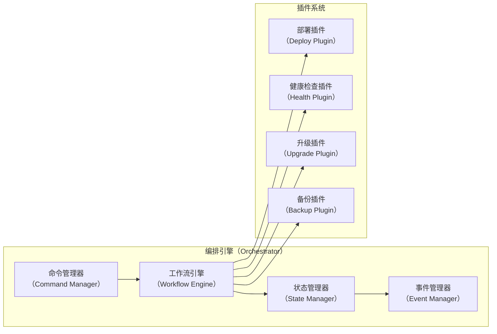
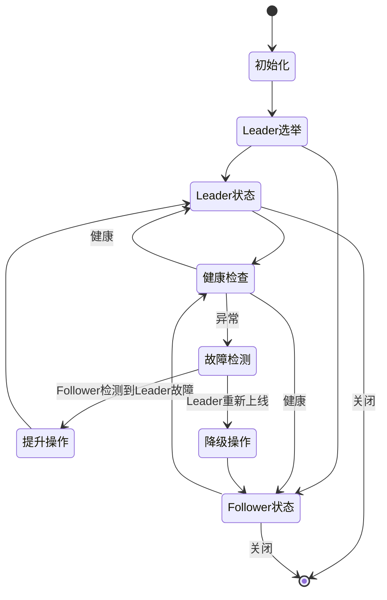
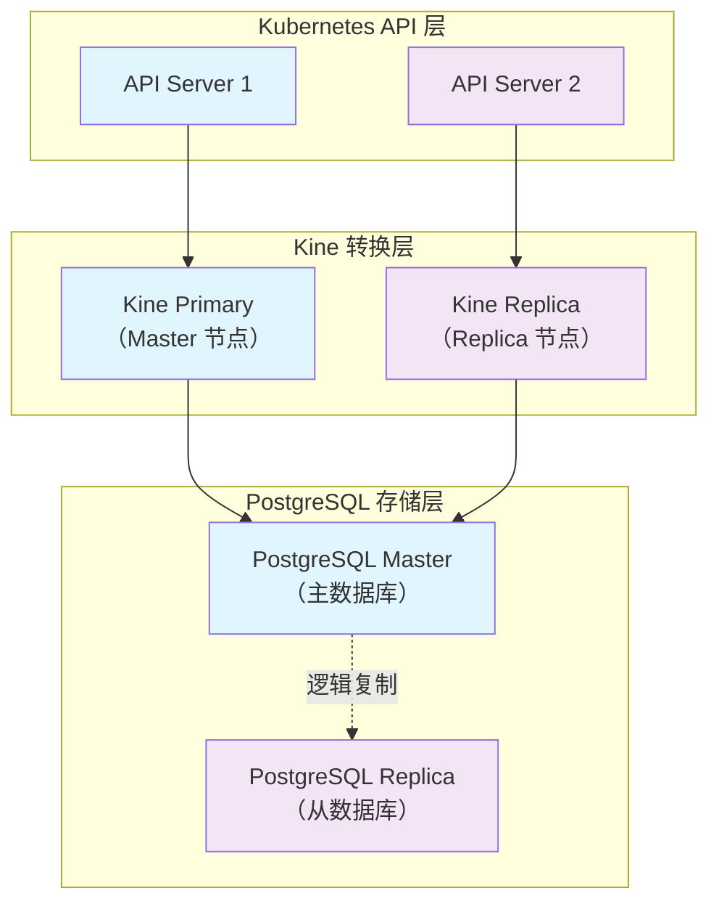
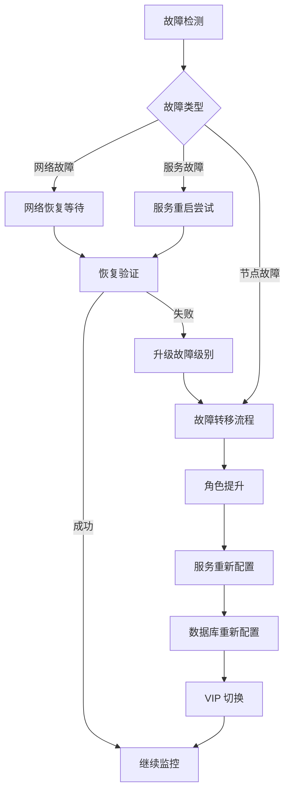

# geminik8s 架构设计文档

## 概述

geminik8s 是一个创新的双节点高可用 Kubernetes 解决方案，专为成本敏感的生产环境设计。通过巧妙地结合 PostgreSQL、Kine 和智能故障转移机制，在保持企业级可靠性的同时，将基础设施成本降低高达 33%。

本文档详细阐述了 geminik8s 的技术架构、设计决策和实现策略，为开发者和运维人员提供深入的技术洞察。

## 领域问题全景分析

### 传统 Kubernetes 高可用的挑战

传统 Kubernetes 高可用部署面临多重挑战，特别是在成本控制和运维复杂度方面：

**成本挑战（Cost Challenges）**：
- etcd 集群的法定人数机制要求最少 3 个节点，直接导致硬件成本增加 50%
- 每增加一个节点，相应的网络、存储、电力和维护成本成倍增长
- 在大规模部署中，额外的节点成本会迅速累积成巨额开支

**技术复杂度（Technical Complexity）**：
- etcd 集群管理需要深度的分布式系统专业知识
- 故障恢复过程复杂，通常需要手动干预
- 数据备份和恢复机制相对复杂，容易出现人为错误

**可扩展性限制（Scalability Limitations）**：
- etcd 性能瓶颈限制了集群规模
- 网络分区场景下的一致性保证机制复杂
- 跨地域部署时延迟敏感性问题

### DFX 问题全景

在可靠性、可维护性、性能和安全性等非功能性需求方面，传统方案存在以下挑战：

**Design for Reliability（可靠性设计）**：
- 单点故障风险：虽然有多节点，但 etcd leader 故障时恢复时间不可预测
- 数据一致性：CAP 定理约束下的一致性与可用性权衡
- 故障检测和恢复的时间窗口较长

**Design for Maintainability（可维护性设计）**：
- 运维复杂度高：需要专业的 etcd 运维知识
- 故障诊断困难：分布式系统的问题定位复杂
- 升级风险：集群升级过程中的停机风险

**Design for Performance（性能设计）**：
- etcd 写入性能限制：影响整体集群性能
- 网络延迟敏感：跨节点通信延迟影响响应时间
- 资源利用率：多节点部署但实际利用率不高

**Design for Security（安全性设计）**：
- 攻击面增大：更多节点意味着更多潜在攻击点
- 证书管理复杂：多节点 TLS 证书管理和轮换

## 解决方案全景

### 核心设计理念

geminik8s 采用"智能简化"的设计哲学，通过以下核心理念解决传统方案的痛点：

1. **成本优先（Cost-First）**：在保证可靠性的前提下，最大化成本效益
2. **简化复杂度（Simplicity Over Complexity）**：用成熟的 SQL 技术替代复杂的分布式键值存储
3. **渐进式可用性（Progressive Availability）**：在一致性和可用性之间找到最佳平衡点
4. **自动化优先（Automation-First）**：最大程度减少人工干预需求

### 技术架构概览

```mermaid
graph TB
    %% 用户层
    subgraph UL[用户层（User Layer）]
        CLI[CLI 工具<br/>（gemin_k8s）]
        WEB[Web 界面<br/>（可选）]
    end

    %% 控制层
    subgraph CL[控制层（Control Layer）]
        ORCH[编排引擎<br/>（Orchestrator）]
        PLUGIN[插件系统<br/>（Plugin System）]
        CONFIG[配置管理<br/>（Config Manager）]
    end

    %% 集群层
    subgraph CLUSTER[集群层（Cluster Layer）]
        subgraph NODE1[节点一（Node 1）]
            K3S1[K3s 服务器<br/>（Leader）]
            KINE1[Kine 代理<br/>（Primary）]
            PG1[PostgreSQL<br/>（Master）]
            LA1[存活代理<br/>（Liveness Agent）]
        end

        subgraph NODE2[节点二（Node 2）]
            K3S2[K3s 服务器<br/>（Follower）]
            KINE2[Kine 代理<br/>（Replica）]
            PG2[PostgreSQL<br/>（Replica）]
            LA2[存活代理<br/>（Liveness Agent）]
        end

        VIP[虚拟 IP<br/>（Virtual IP）]
    end

    %% 基础设施层
    subgraph IL[基础设施层（Infrastructure Layer）]
        NET[网络层<br/>（Network）]
        STORAGE[存储层<br/>（Storage）]
        MONITOR[监控层<br/>（Monitoring）]
    end

    %% 连接关系
    CLI --> ORCH
    WEB --> ORCH
    ORCH --> PLUGIN
    ORCH --> CONFIG
    CONFIG --> NODE1
    CONFIG --> NODE2
    
    K3S1 --> KINE1
    K3S2 --> KINE2
    KINE1 --> PG1
    KINE2 --> PG1
    PG1 -.->|逻辑复制| PG2
    LA1 <--> LA2
    VIP --> K3S1
    
    NODE1 --> IL
    NODE2 --> IL
````

系统采用分层架构设计，从上至下分为用户层、控制层、集群层和基础设施层。用户通过 CLI 工具与编排引擎交互，编排引擎协调插件系统和配置管理，最终作用于双节点集群。集群内部通过 PostgreSQL 逻辑复制和存活代理实现高可用性。

### 数据流架构

```mermaid
sequenceDiagram
    participant U as 用户（User）
    participant CLI as CLI 工具
    participant O as 编排引擎
    participant L as Leader 节点
    participant F as Follower 节点
    participant VIP as 虚拟 IP

    %% 正常操作流程
    U->>CLI: gemin_k8s deploy
    CLI->>O: 解析配置
    O->>L: 初始化 Leader
    O->>F: 初始化 Follower
    L->>L: 启动 PostgreSQL Master
    L->>L: 启动 Kine Primary
    L->>L: 启动 K3s Server
    F->>F: 启动 PostgreSQL Replica
    F->>L: 配置逻辑复制
    F->>F: 启动 Kine Replica
    F->>F: 启动 K3s Server
    
    %% 健康检查循环
    loop 存活检查
        L->>F: 健康检查
        F->>L: 响应状态
        F->>L: 健康检查
        L->>F: 响应状态
    end
    
    %% VIP 管理
    L->>VIP: 绑定虚拟 IP
    VIP-->>U: 服务访问
```

数据流设计确保了系统的高可用性和一致性。在正常操作中，Leader 节点承担主要的写入操作，Follower 节点通过 PostgreSQL 逻辑复制保持数据同步。双向健康检查机制确保故障的快速检测和响应。

## 核心组件详细设计

### CLI 引擎设计（基于 Cobra）

CLI 引擎是用户与 geminik8s 交互的主要入口，基于 Cobra 框架构建，提供直观的命令行体验：

**命令结构设计**：

```
gemin_k8s [全局选项]
├── init [初始化选项]        # 初始化集群配置
│   ├── --name string       # 集群名称
│   ├── --node1-ip string   # 第一个节点 IP
│   ├── --node2-ip string   # 第二个节点 IP
│   ├── --vip string        # 虚拟 IP 地址
│   ├── --config-dir string # 配置文件输出目录
│   ├── --template string   # 配置模板路径
│   ├── --interactive       # 交互式配置向导
│   └── --dry-run           # 仅验证配置不生成文件
│
├── deploy [部署选项]        # 部署双节点集群
│   ├── --config-dir string # 配置文件目录
│   ├── --bootstrap-leader string # 指定引导主节点
│   ├── --timeout duration  # 部署超时时间
│   ├── --parallel          # 并行部署节点
│   ├── --skip-preflight    # 跳过预检查
│   ├── --force             # 强制部署
│   └── --watch             # 实时显示部署进度
│
├── status [状态查询选项]     # 查看集群状态
│   ├── --cluster string    # 指定集群名称
│   ├── --output string     # 输出格式 (table|json|yaml)
│   ├── --watch             # 持续监控状态变化
│   ├── --refresh duration  # 状态刷新间隔
│   ├── --details           # 显示详细信息
│   ├── --components        # 显示组件状态
│   └── --health-only       # 仅显示健康状态
│
├── failover [故障转移选项]   # 手动故障转移
│   ├── --cluster string    # 目标集群名称
│   ├── --promote string    # 提升为主节点的节点
│   ├── --timeout duration  # 转移超时时间
│   ├── --force             # 强制故障转移
│   ├── --dry-run           # 仅模拟转移过程
│   ├── --wait              # 等待转移完成
│   └── --verify            # 验证转移结果
│
├── upgrade [升级选项]       # 集群升级
│   ├── --cluster string    # 目标集群名称
│   ├── --version string    # 目标版本
│   ├── --image string      # 自定义升级镜像
│   ├── --strategy string   # 升级策略 (rolling|parallel)
│   ├── --backup            # 升级前自动备份
│   ├── --rollback-timeout duration # 回滚超时时间
│   ├── --skip-validation   # 跳过版本兼容性验证
│   └── --auto-rollback     # 升级失败自动回滚
│
├── replace-node [节点替换选项] # 节点替换
│   ├── --cluster string    # 目标集群名称
│   ├── --old-node string   # 待替换的节点标识
│   ├── --new-node-ip string # 新节点 IP 地址
│   ├── --preserve-data     # 保留数据进行迁移
│   ├── --timeout duration  # 替换操作超时
│   ├── --drain-timeout duration # 节点排水超时
│   └── --verify            # 验证替换结果
│
├── backup [备份选项]        # 数据备份
│   ├── --cluster string    # 目标集群名称
│   ├── --output string     # 备份文件输出路径
│   ├── --type string       # 备份类型 (full|incremental)
│   ├── --compress          # 压缩备份文件
│   ├── --encryption-key string # 备份加密密钥
│   ├── --retention int     # 备份保留天数
│   └── --verify            # 验证备份完整性
│
├── restore [恢复选项]       # 数据恢复
│   ├── --cluster string    # 目标集群名称
│   ├── --backup-file string # 备份文件路径
│   ├── --target-time string # 恢复到指定时间点
│   ├── --dry-run           # 仅验证恢复过程
│   ├── --force             # 强制恢复覆盖现有数据
│   └── --verify            # 验证恢复结果
│
└── version [版本选项]       # 版本信息
    ├── --output string     # 输出格式 (text|json|yaml)
    ├── --short             # 仅显示版本号
    └── --check-update      # 检查更新版本

[全局选项]
├── --config string         # 配置文件路径
├── --log-level string      # 日志级别 (debug|info|warn|error)
├── --log-file string       # 日志文件路径
├── --no-color              # 禁用彩色输出
├── --quiet                 # 静默模式
├── --verbose               # 详细输出
└── --help                  # 显示帮助信息

```

**核心实现特性**：

* 统一的错误处理和日志记录
* 配置文件自动发现和验证
* 交互式配置向导
* 进度指示和状态反馈
* Shell 自动补全支持

### 编排引擎设计

编排引擎是 geminik8s 的核心大脑，负责协调各个组件的工作流程：



编排引擎通过插件系统实现功能的模块化和可扩展性。命令管理器处理 CLI 输入，工作流引擎协调执行步骤，状态管理器维护集群状态，事件管理器处理异步事件。

### 插件接口设计

插件系统为 geminik8s 提供了强大的扩展能力：

**插件接口规范**：

```go
type Plugin interface {
    Name() string
    Version() string
    Execute(ctx context.Context, params PluginParams) (*PluginResult, error)
    Validate(params PluginParams) error
    Cleanup(ctx context.Context) error
}
```

**插件类型**：

* **部署插件**：负责节点初始化和服务部署
* **健康检查插件**：实现各种健康检查策略
* **升级插件**：处理滚动升级和回滚
* **备份插件**：数据备份和恢复策略
* **监控插件**：集成各种监控系统

### 双节点高可用机制

#### 角色管理和选举

geminik8s 实现了一套基于主机元数据（hostMeta）的角色管理机制：



角色管理采用有限状态机设计，确保状态转换的一致性和可预测性。每个节点维护本地的 hostMeta 文件，记录集群拓扑和角色信息。

#### PostgreSQL + Kine 存储架构

传统 Kubernetes 依赖 etcd 作为存储后端，geminik8s 创新性地采用 PostgreSQL + Kine 组合：



**存储架构优势**：

* **成熟技术栈**：PostgreSQL 是经过数十年验证的企业级数据库
* **运维简化**：相比 etcd 集群，PostgreSQL 的运维更为简单直观
* **性能优化**：SQL 查询优化器提供更好的查询性能
* **扩展性**：支持更大规模的数据存储和查询

#### 故障检测和恢复机制

geminik8s 实现了多层次的故障检测机制：

**健康检查层级**：

1. **网络连通性检查**：ICMP ping 和 TCP 连接测试
2. **服务健康检查**：Kubernetes API 服务器响应测试
3. **数据库连接检查**：PostgreSQL 连接和查询测试
4. **自定义健康脚本**：支持用户定义的健康检查逻辑

**故障恢复流程**：



故障恢复采用分级处理策略，从最小干预开始，逐步升级到更复杂的恢复操作。

## 预期效果全景及展望

### 成本效益分析

geminik8s 在成本优化方面具有显著优势：

**直接成本节省**：

* **硬件成本**：双节点相比三节点，硬件采购成本直接降低 33%
* **电力成本**：减少一个节点的功耗，年电力成本降低约 25-30%
* **网络成本**：减少网络端口和带宽需求
* **机房成本**：降低机柜空间占用

**间接成本节省**：

* **运维成本**：简化的 PostgreSQL 运维相比复杂的 etcd 集群管理
* **培训成本**：运维人员对 SQL 数据库的熟悉程度更高
* **故障恢复成本**：更快的故障检测和恢复减少业务中断损失

**规模化效益**：
在大规模部署场景下，成本节省效果更加显著。以 1000 个站点为例：

* 传统方案：3000 个节点
* geminik8s 方案：2000 个节点
* **节省 1000 个节点的全生命周期成本**

### 技术性能预期

**可用性指标**：

* **目标可用性**：99.9% 年度可用性（相比传统三节点的 99.99%）
* **故障转移时间**：平均 4.5 分钟（基准测试结果）
* **数据一致性**：最终一致性，同步延迟 < 100ms

**性能指标**：

* **API 响应时间**：与标准 K3s 集群相当
* **吞吐量**：支持标准 Kubernetes 工作负载
* **扩展性**：支持最多 100 个工作节点

### 发展路线图和展望

**近期目标（6个月内）**：

* 完成核心功能开发和测试
* 发布 v1.0 正式版本
* 建立社区生态和文档体系
* 通过 CNCF 沙箱项目申请

**中期目标（1年内）**：

* 支持多种 Kubernetes 发行版（K3s, K8s, RKE2）
* 集成主流云原生工具链
* 企业级功能增强（RBAC、审计、合规）
* 获得生产环境验证案例

**长期愿景（2-3年）**：

* 成为成本敏感场景下的标准高可用方案
* 支持多云和混合云部署
* AI/ML 工作负载优化
* 边缘计算场景扩展

## 技术实现细节

### 代码结构设计


```
geminik8s/
├── cmd/                           # 命令行入口点
│   └── gemin_k8s/                # 主命令行工具
│       └── main.go
├── internal/                      # 内部包，不对外暴露
│   ├── app/                      # 应用层
│   │   ├── cli/                  # CLI 处理逻辑
│   │   ├── config/               # 配置管理
│   │   └── orchestrator/         # 编排引擎
│   ├── domain/                   # 领域层
│   │   ├── cluster/              # 集群领域模型
│   │   ├── node/                 # 节点领域模型
│   │   └── storage/              # 存储领域模型
│   ├── infrastructure/           # 基础设施层
│   │   ├── database/             # 数据库操作
│   │   ├── kubernetes/           # Kubernetes 客户端
│   │   ├── network/              # 网络操作
│   │   └── system/               # 系统调用
│   └── pkg/                      # 内部共享包
│       ├── errors/               # 错误定义
│       ├── logger/               # 日志记录
│       └── utils/                # 工具函数
├── pkg/                          # 公开的 API 包
│   ├── api/                      # API 接口定义
│   ├── client/                   # 客户端 SDK
│   └── types/                    # 公共类型定义
├── plugins/                      # 插件实现
│   ├── deploy/                   # 部署插件
│   ├── health/                   # 健康检查插件
│   ├── upgrade/                  # 升级插件
│   └── backup/                   # 备份插件
├── scripts/                      # 构建和部署脚本
│   ├── build/                    # 构建脚本
│   ├── deploy/                   # 部署脚本
│   └── test/                     # 测试脚本
├── configs/                      # 配置文件模板
│   ├── cluster/                  # 集群配置模板
│   └── node/                     # 节点配置模板
├── docs/                         # 文档
│   ├── architecture.md           # 架构文档（本文档）
│   ├── installation.md           # 安装指南
│   ├── operations.md             # 操作手册
│   └── troubleshooting.md        # 故障排除
├── tests/                        # 测试文件
│   ├── integration/              # 集成测试
│   ├── e2e/                     # 端到端测试
│   └── fixtures/                 # 测试夹具
├── deployments/                  # 部署配置
│   ├── docker/                   # Docker 配置
│   ├── helm/                     # Helm 图表
│   └── manifest/                 # Kubernetes 清单
├── examples/                     # 示例配置
│   ├── basic/                    # 基础配置示例
│   └── advanced/                 # 高级配置示例
├── .github/                      # GitHub 配置
│   └── workflows/                # CI/CD 工作流
├── go.mod                        # Go 模块定义
├── go.sum                        # Go 模块校验和
├── Makefile                      # 构建配置
├── Dockerfile                    # 容器镜像构建
├── README.md                     # 项目说明
├── README-zh.md                  # 中文项目说明
├── LICENSE                       # 许可证
└── CONTRIBUTING.md               # 贡献指南
```

### CAP 定理权衡分析

在分布式系统设计中，geminik8s 在 CAP 定理的框架下做出了明智的权衡：

**一致性（Consistency）权衡**：

* 采用最终一致性模型，而非强一致性
* PostgreSQL 逻辑复制提供秒级数据同步
* 在网络分区时允许短期数据不一致

**可用性（Availability）增强**：

* 双节点设计在单节点故障时保持服务可用
* 自动故障转移减少人工干预时间
* 应用层高可用通过 DaemonSet 和拓扑约束实现

**分区容错性（Partition Tolerance）保证**：

* 使用 lastModified 时间戳作为分区恢复的仲裁机制
* 网络分区恢复后自动协调数据状态
* 支持完全离线的集群运行模式

## 参考资料

\[1] Kairos - Composable Operating System: [https://kairos.io/](https://kairos.io/)

\[2] K3s - Lightweight Kubernetes: [https://k3s.io/](https://k3s.io/)

\[3] kube-vip - Virtual IP and Load Balancer: [https://github.com/kube-vip/kube-vip](https://github.com/kube-vip/kube-vip)

\[4] Harbor - Cloud Native Registry: [https://goharbor.io/](https://goharbor.io/)

\[5] System Upgrade Controller: [https://github.com/rancher/system-upgrade-controller](https://github.com/rancher/system-upgrade-controller)

\[6] Kine - etcd API to SQL: [https://github.com/k3s-io/kine](https://github.com/k3s-io/kine)

\[7] PostgreSQL Official Documentation: [https://www.postgresql.org/](https://www.postgresql.org/)

\[8] CAP Theorem: [https://en.wikipedia.org/wiki/CAP\_theorem](https://en.wikipedia.org/wiki/CAP_theorem)

\[9] Kubernetes Architecture: [https://kubernetes.io/docs/concepts/architecture/](https://kubernetes.io/docs/concepts/architecture/)

\[10] Cobra CLI Framework: [https://github.com/spf13/cobra](https://github.com/spf13/cobra)